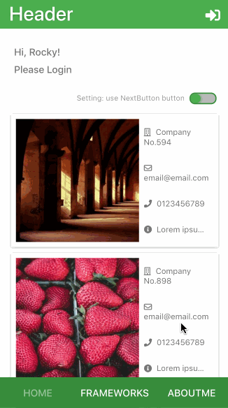
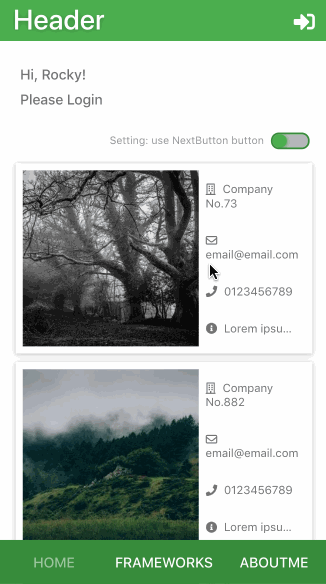
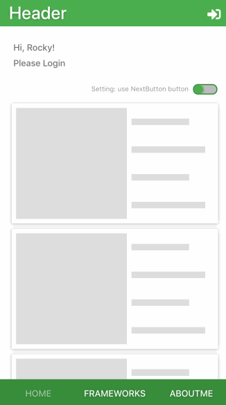
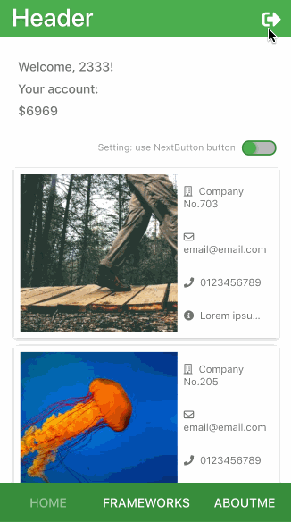
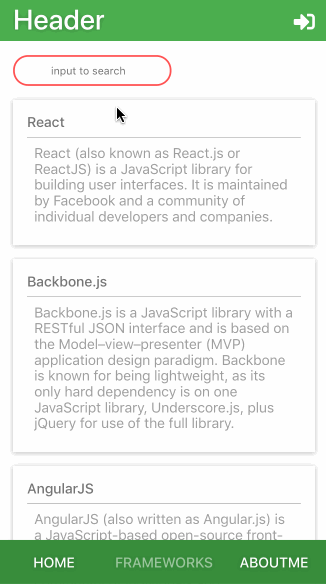
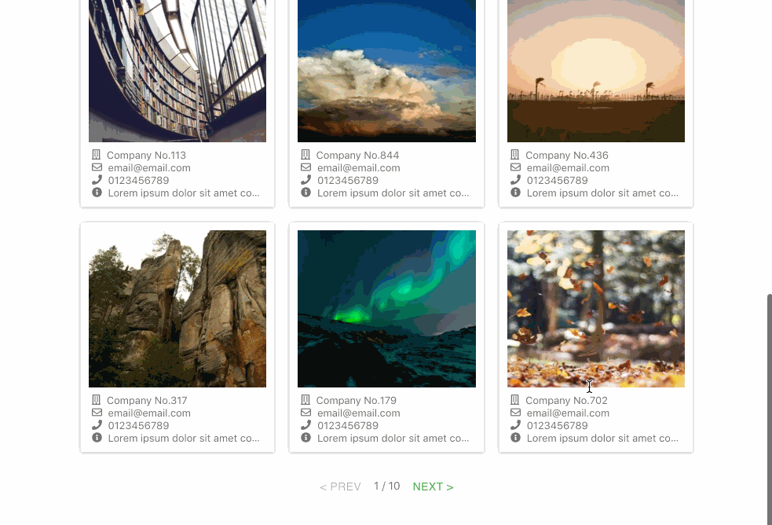

# About
React/Redux 响应式设计流体布局练手项目

# Features

* request and show data from server
* responsive designed, flex layout
* different interaction for different device
  * mobile: click a button to load the next page or infinite scroll (user can choose either of them)
  * web: use progress stepper to show paged data
    * only send the request to fetch data from API when necessary
* notification component
* show loading indicator using React Hooks
* use material palette, customed material-ui and font awesome

# GIF Demonstration

**按钮翻页**

**切换为无限加载**

**慢网速下**

**登录注册登出**

**搜索框**

**PC**
